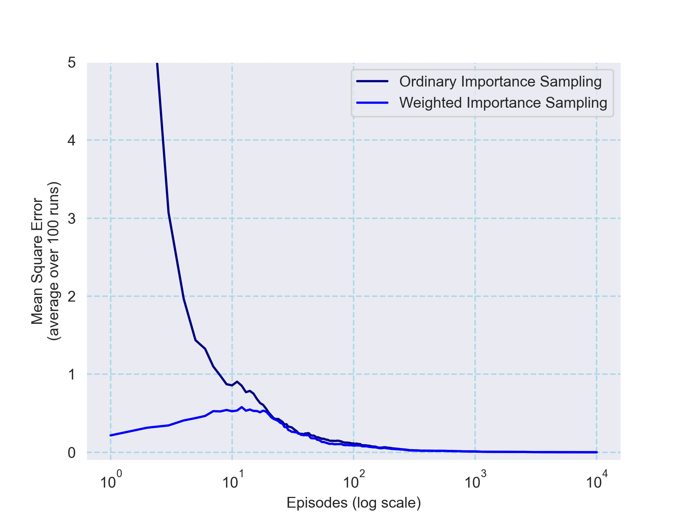

# Blackjack

## Overview

This project implements Monte Carlo simulation methods for a simplified version of Blackjack. The simulation applies various sampling methods—including on‑policy prediction, Monte Carlo Exploring Starts (MC ES), and off‑policy evaluation via importance sampling—to estimate state and action values. The approach follows the ideas described in Chapter 5 (Monte Carlo Methods) of Sutton & Barto’s *Reinforcement Learning*. The simulation also provides heatmaps and learning curves as output visualizations.

## Project Structure

```
blackjack/
├── book_images/
│   ├── Figure_5_1.PNG                # Reference figure for state-value function estimates
│   ├── Figure_5_2.PNG                # Reference figure for optimal policy and value function via MC ES
│   ├── Figure_5_3.PNG                # Reference figure for importance sampling error curves
│   └── blackjack-card-values.png     # Diagram of Blackjack card values used in the simulation
├── generated_images/
│   ├── figure_5_1.png                # Heatmap of state values estimated using on‑policy Monte Carlo simulation
│   ├── figure_5_2.png                # Heatmaps for the optimal policy and state-value function from MC ES
│   └── figure_5_3.png                # Learning curves showing mean squared error for off‑policy estimates
├── notebooks/
│   └── blackjack.ipynb               # Jupyter Notebook providing interactive simulation experiments
├── requirements/                     # Folder listing required packages (details provided in the general README)
└── src/
    ├── __init__.py
    └── blackjack.py                  # Source code for the Blackjack simulation class and figure generation
```

## How to Run

To experiment with the simulation, use one of the following bash commands from the repository root:

```bash
# To run the interactive Jupyter Notebook:
jupyter notebook notebooks/blackjack.ipynb

# Alternatively, to run the simulation script directly:
python src/blackjack.py
```

## Example Output

The simulation produces several output figures. Examples include:

- **Figure 5.1** – A heatmap of state-value estimates from on‑policy Monte Carlo simulation:
  
  

- **Figure 5.2** – Heatmaps showing the optimal policy and state-value function, computed via MC ES:
  
  

- **Figure 5.3** – Learning curves comparing mean squared error for ordinary and weighted importance sampling methods:
  
  
