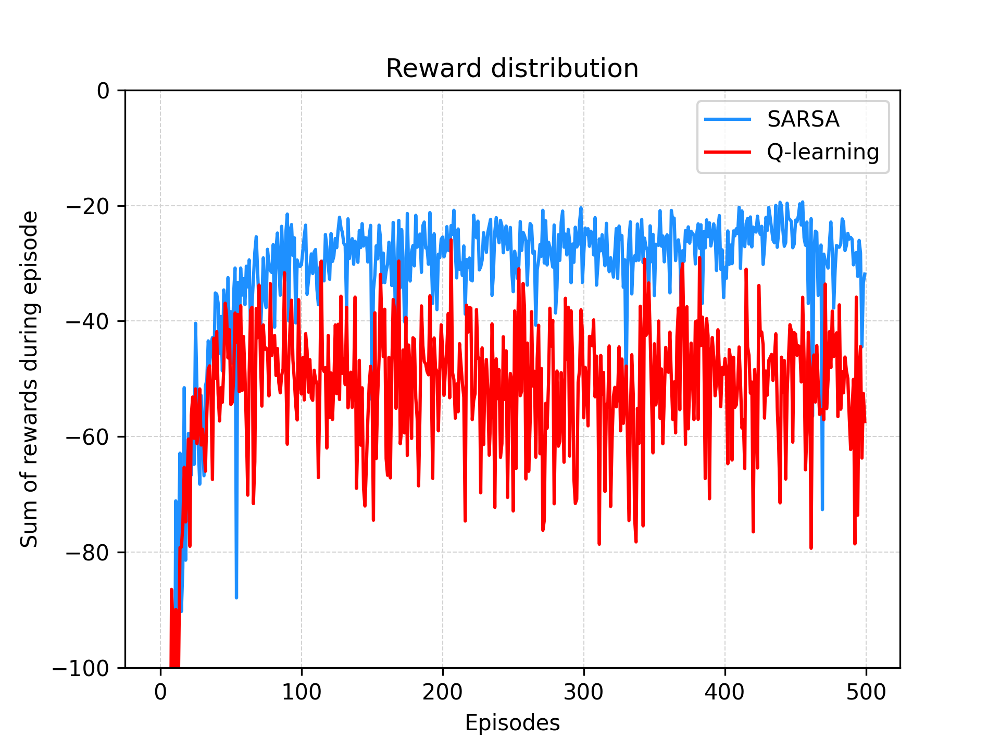
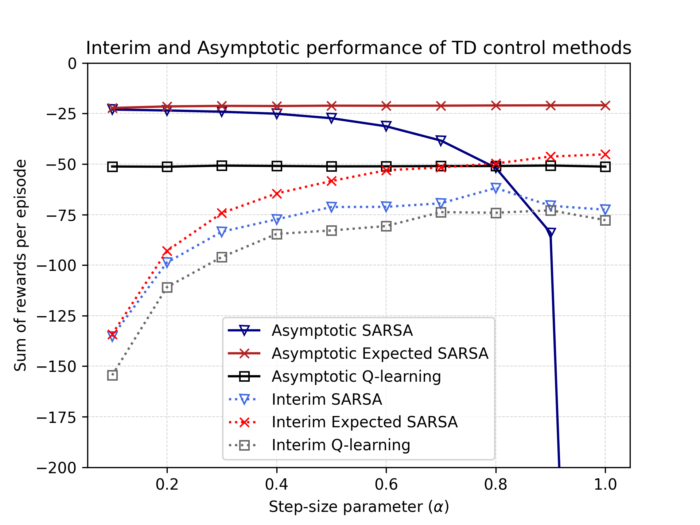

# Cliff Walking — SARSA vs Q-learning Comparison

A small project implementing the cliff walking gridworld example from Sutton & Barto and reproducing Examples 6.6 and Figure 6.3 comparing on-policy (SARSA) and off-policy (Q-learning) methods.
The notebook reads reference images from `book_images/` and saves generated plots to `generated_images/`.

---

## Project structure

```
cliff_walking/
├─ book_images/            # reference images used in notebook 
│  ├─ Example_6_6_grid.PNG
│  ├─ Example_6_6_graph.PNG
│  └─ Figure_6_3.PNG
├─ generated_images/       # notebook will write generated PNGs here
│  ├─ example_6_6.png
│  └─ figure_6_3.png
├─ notebooks/              # Jupyter notebook (run this to reproduce figures)
│  └─ cliff_walking.ipynb
└─ src/                    # source package
   ├─ __init__.py
   └─ cliff_walking.py
```

---

## The Cliff Walking Problem

The experiment uses a 4×12 gridworld that demonstrates the difference between on-policy and off-policy learning:


  


- **Grid Layout**: 4 rows × 12 columns with start at bottom-left [3,0] and goal at bottom-right [3,11]
- **Actions**: Standard movement (`up`, `down`, `left`, `right`)
- **Rewards**: 
  - Normal transitions: -1
  - Stepping into "The Cliff" (bottom row, columns 1-10): -100 and return to start
- **Policy**: ε-greedy with ε = 0.1
- **Learning**: Undiscounted episodic task (γ = 1)

The cliff creates a tradeoff between optimal path (risky, along cliff edge) and safe path (longer, through upper region).

---

## How to run

Open `notebooks/cliff_walking.ipynb` and run all cells. The notebook uses `matplotlib.use('Agg')` and saves figures to `../generated_images/*.png`.

## Expected outputs & visualizations

The notebook generates two main figures:

* `generated_images/example_6_6.png` — Learning curves comparison (from `notebooks/cliff_walking.ipynb`).


  


  This plot shows **sum of rewards per episode** (y-axis) vs **episode number** (x-axis) for two algorithms:
  - **SARSA (on-policy)**: Learns safer path through upper grid, achieving better online performance (~-25 reward per episode)
  - **Q-learning (off-policy)**: Learns optimal policy (cliff edge) but suffers from ε-greedy exploration causing cliff falls (~-80 reward per episode)
  
  Key parameters:
  - `runs = 50` independent runs for statistical reliability
  - `episodes = 500` per run
  - `exploration_probability = 0.1` (ε-greedy)
  - `step_size = 0.5` (α learning rate)
  - `discount = 1.0` (γ discount factor)
  
  The figure demonstrates that despite Q-learning learning the optimal value function, SARSA achieves better online performance by accounting for the exploration policy during learning.

* `generated_images/figure_6_3.png` — Step-size parameter comparison (from `notebooks/cliff_walking.ipynb`).


  


  This plot shows **sum of rewards per episode** (y-axis) vs **step-size parameter α** (x-axis) for six different conditions:
  - **Asymptotic performance**: Average over all episodes for SARSA, Expected SARSA, and Q-learning
  - **Interim performance**: Average over first 100 episodes for SARSA, Expected SARSA, and Q-learning
  
  Key parameters:
  - `runs = 10` independent runs (increase to 50,000 for fully averaged performance)
  - `episodes = 10,000` per run (increase to 100,000 for complete averaging)
  - `step_sizes = [0.1, 0.2, ..., 1.0]` tested range
  
  The figure shows how different algorithms perform across step-size parameters, with Expected SARSA typically showing the best and most stable performance across different α values.

## Algorithm Details

- **SARSA**: On-policy TD control using the action actually taken by the ε-greedy policy for updates
- **Expected SARSA**: Uses expected value under the policy instead of the sampled next action
- **Q-learning**: Off-policy TD control using the greedy action (max) for updates regardless of exploration
- **Key Difference**: SARSA accounts for exploration during learning, Q-learning learns optimal policy but suffers during exploration

## Policy Visualization

The notebook also displays the learned optimal policies:
- **SARSA Policy**: Safe path avoiding cliff edge (arrows showing route through upper grid)
- **Q-learning Policy**: Optimal path along cliff edge (direct route with risk of falls during exploration)

Both policies are printed as directional arrows (↑↓←→) showing the greedy action in each grid cell.