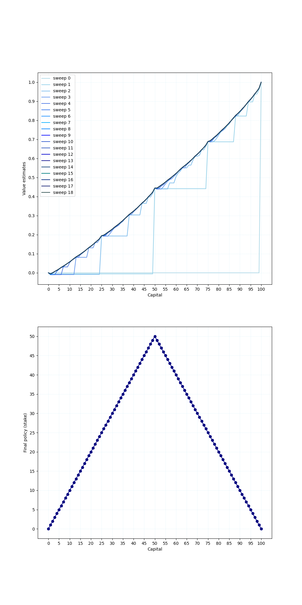

# Gambler's Problem – Value Iteration 

This project implements the **Gambler's Problem** from Sutton & Barto's *Reinforcement Learning* book (Chapter 4), using **value iteration** to find the optimal policy.

## Problem Description

A gambler has the opportunity to make bets on coin flips:
- If heads, they win the amount staked.
- If tails, they lose the stake.
- The game ends if the gambler reaches the goal (e.g. $100) or loses all their money.

### Key Concepts
- **State:** Gambler's capital (from $1 to $99).
- **Actions:** Amount of stake (in whole dollars).
- **Transition:** Based on outcome (heads/tails) and stake.
- **Reward:** +1 for reaching $100, 0 otherwise.
- **Goal:** Maximize probability of reaching $100.
- **Policy:** Mapping from capital to optimal stake.

### Value Iteration Setup
- Discount factor: 1.0 (undiscounted).
- Probability of heads: `p_h = 0.45`
- Small penalty added for losing to encourage faster convergence.
- Value iteration runs until the maximum change is smaller than `1e-9`.

### Outputs
- A plot showing:
  - The evolution of value function over sweeps.
  - The final optimal policy.

## Requirements
- Python 3.x
- Libraries: `numpy`, `matplotlib`

## Run Instructions

This will:
- Perform value iteration.
- Generate a two-part figure.
- Save the plot to: `../generated_images/figure_4_3.png`

## Example Output

