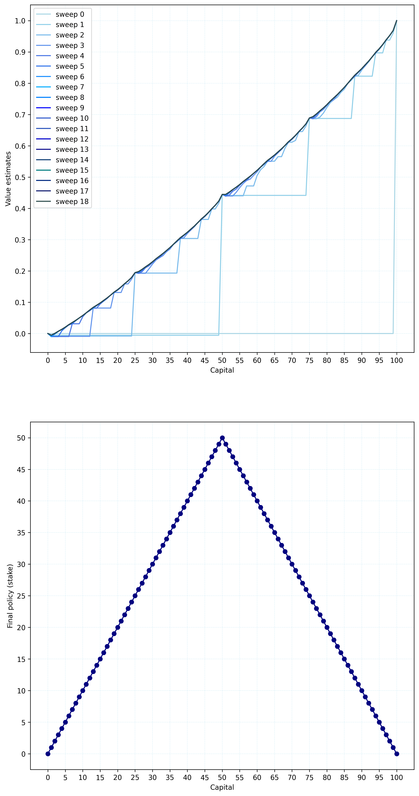

# Gambler's Problem

## Overview

This project implements the Gambler's Problem using value iteration—a classic example from Chapter 4 (Dynamic Programming) of Sutton & Barto’s *Reinforcement Learning*. The agent determines the optimal betting strategy on coin flips to maximize the probability of reaching a capital goal.

## Project Structure

```
gamblers_problem/
├── book_images/
│   └── Figure_4_3.PNG      # Reference figure from the original text.
├── generated_images/
│   └── figure_4_3.png      # The generated output showing the evolution of the value function and final policy.
└── notebooks/
    └── gamblers_problem.py # Python script/notebook that performs value iteration and plots the results.
```

## How to Run

Execute the project using the following bash command from the repository’s root:

```bash
# Run the gamblers problem script:
python notebooks/gamblers_problem.py
```

Alternatively, launch the Jupyter Notebook if you prefer:

```bash
jupyter notebook notebooks/gamblers_problem.py
```

## Example Output

The generated figure, based on successive sweeps of value iteration and policy extraction, is displayed at 60% of its original size:

