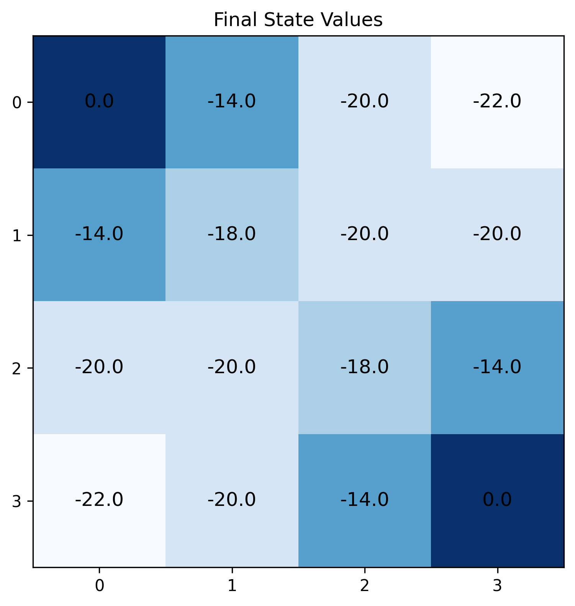

# Gridworld Dynamic Programming

This repository implements a **Gridworld** environment and demonstrates various **Dynamic Programming (DP)** methods for Reinforcement Learning, such as **Iterative Policy Evaluation** and **(In-place) Policy Iteration**. The project is inspired by examples in Sutton & Barto’s *Reinforcement Learning: An Introduction*.

## Table of Contents
- [Overview](#overview)
- [Project Structure](#project-structure)
- [Bellman Equation](#bellman-equation)
- [Policy Iteration](#policy-iteration)
- [Usage](#usage)
- [Example Results](#example-results)

---

## Overview

The **Gridworld** is a simple environment in which an agent moves on a 2D grid. It receives a reward of $-1$ on every step until it reaches a terminal state (in this case, the top-left or bottom-right corners of the grid). The goal is to estimate the **state-value function** $V(s)$ under a given policy or to find an optimal policy.

### Key Points

1. **Grid Size**: You can change the size of the grid (default is $4 \times 4$).
2. **Actions**: The agent can move up, down, left, or right.
3. **Terminal States**: Top-left $(0,0)$ and bottom-right (grid_size-1, grid_size-1).
4. **Reward**: $-1$ on each step until reaching a terminal state.
5. **Discount Factor**: $\gamma$ (default is $1.0$).
6. **In-place Updates**: You can update values in-place or out-of-place.

---

## Project Structure

```
gridworld-dp/
│
├─ book_images/
│   ├─ Example_4.1.PNG
│   └─ Figure_4.1.PNG
│
├─ generated_images/
│   └─ [Where output plots are saved automatically]
│
├─ notebooks/
│   └─ grid_world.ipynb  # Jupyter Notebook showcasing how to use the code
│
├─ src/
│   ├─ __init__.py
│   └─ grid_world.py     # Main GridWorld class & methods
│
└─ README.md             # This file
```

1. **`book_images/`** contains example figures from the original reference book or your own illustrations.
2. **`generated_images/`** is the folder where any plots generated by the `draw` method are saved.
3. **`notebooks/`** includes a sample Jupyter notebook (`grid_world.ipynb`) demonstrating usage of the code.
4. **`src/`** contains the Python source files:
   - **`grid_world.py`**: Defines the `GridWorld` class, the environment’s dynamics, and the DP methods (iterative policy evaluation, etc.).

---

## Bellman Equation

In **Iterative Policy Evaluation**, we use the Bellman equation to update the estimated state-value function $V(s)$. For a given policy $\pi$, the Bellman equation is:


$V_{\pi}(s) = \sum_{a \in \mathcal{A}(s)} \pi(a \mid s) \Big[r(s, a) + \gamma V_{\pi}(s') \Big]$

where:
- $\mathcal{A}(s)$ is the set of valid actions in state $s$.
- $\pi(a \mid s)$ is the probability of taking action $a$ in state $s$.
- $r(s, a)$ is the reward for taking action $a$ in state $s$.
- $\gamma$ is the discount factor.
- $s'$ is the next state after taking action $a$ in state $s$.

By iterating over all states and actions, we can approximate $V_{\pi}(s)$ until convergence (within a small threshold).

---

## Policy Iteration

**Policy Iteration** is a two-step process repeated until convergence:
1. **Policy Evaluation**: Estimate $V_{\pi}(s)$ under the current policy $\pi$ (using the Bellman equation).
2. **Policy Improvement**: Update the policy $\pi$ by choosing the action(s) that maximizes the expected return based on the newly evaluated $V_{\pi}(s)$.

Mathematically, the improved policy $\pi'$ is defined as:

$\pi'(s) = \arg\max_{a \in \mathcal{A}(s)} \bigl[r(s,a) + \gamma V_{\pi}(s') \bigr].$

This process is repeated until the policy stabilizes (i.e., no changes in the chosen actions).

---

## Usage

1. **Clone or Download** this repository.
2. **Install Dependencies**:
   ```bash
   pip install numpy matplotlib
   ```
3. **Run the Notebook**: In the `notebooks/` folder, open `grid_world.ipynb` to see examples of iterative policy evaluation or policy iteration in action.
4. **Or Use the Python Module Directly**:
   ```python
   from src.grid_world import GridWorld

   env = GridWorld(grid_size=4, discount=1.0, threshold=1e-4, in_place=True)
   state_values, iterations = env.compute_state_value(show_policy=False, show_arrows=False)
   print(f"Converged in {iterations} iterations.")
   env.draw(state_values, is_policy=False, title="Final State Values")
   ```

---

## Example Results

Below is an example image showing the **final state-values** after applying iterative policy evaluation on a $4 \times 4$ grid:



In the above heatmap, darker cells indicate lower values (further from a terminal), while lighter cells indicate higher values (closer to a terminal).  
*(Note: This example image is for illustration; actual appearance depends on your code and color normalization.)*

---