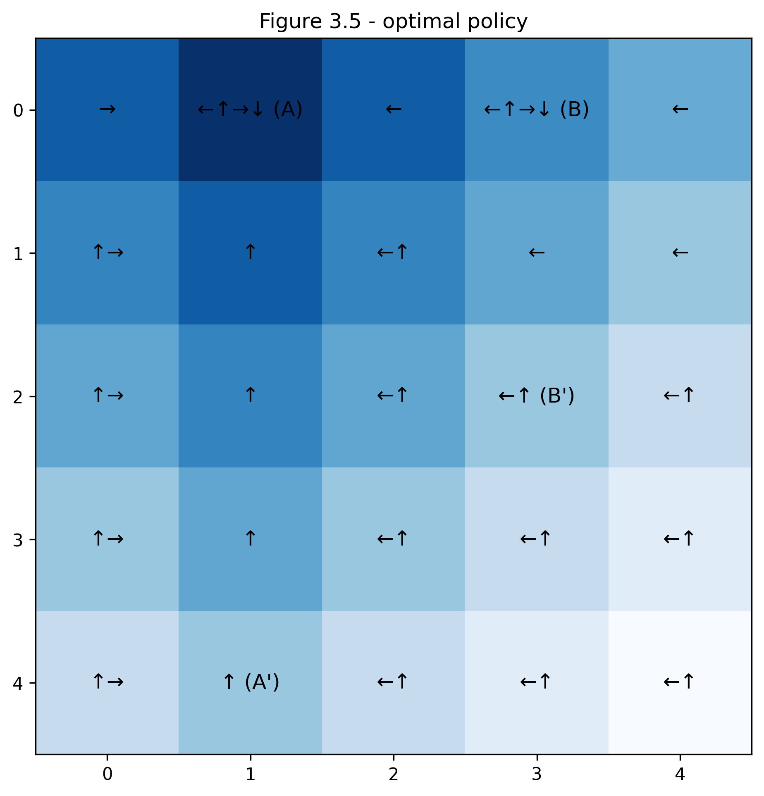

# **Grid World - MDP**
## Overview

This project implements a Grid World environment—a 5x5 grid where an agent learns to navigate towards a reward using dynamic programming methods. It helps illustrate Markov Decision Processes (MDPs) and optimal policy extraction as described in Chapter 4 (Dynamic Programming in MDPs) of Sutton & Barto’s *Reinforcement Learning*.

## Project Structure

```
gridworld_rl/
├── src/
│   └── grid_world.py    # Contains the GridWorld class and DP algorithm implementations.
├── notebooks/
│   └── grid_world.ipynb # Notebook showcasing experiments and visualizations.
└── generated_images/
    └── figure_35__optimal_policy.png   # Example image of the optimal policy visualization.
```

## How to Run

Use the following command to launch the Jupyter Notebook or run the script directly:

```bash
# Launch the Jupyter Notebook:
jupyter notebook notebooks/grid_world.ipynb

# Alternatively, run the Python script:
python src/grid_world.py
```

## Optimal Policy Visualization

After running the value iteration algorithm, we obtain the optimal policy for the Grid World environment:

