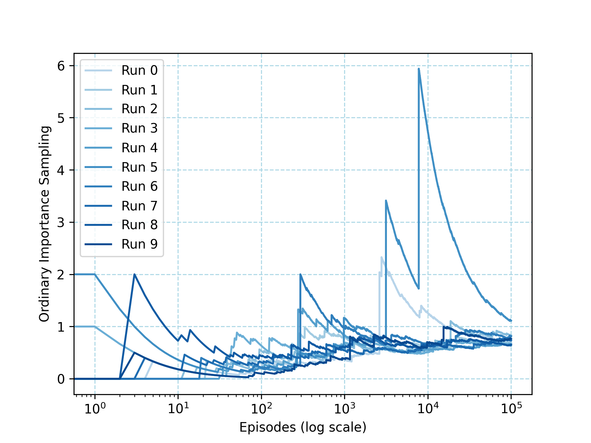

# Infinite Variance Off‑Policy Monte Carlo

## Overview

This project illustrates the phenomenon of infinite variance in ordinary importance sampling when performing off‑policy Monte Carlo estimation, based on the example in Chapter 5 (Off‑Policy Methods with Importance Sampling) of Sutton & Barto’s *Reinforcement Learning*. Specifically, it implements the two‑action MDP depicted in Figure 5.4:

- A single non‑terminal state `s`.
- Two actions:
  - **right**: terminates immediately with reward 0.
  - **left**: with probability 0.9 returns to `s` with reward 0, and with probability 0.1 transitions to termination with reward 1.
- Target policy $π$ always chooses `left`.  
- Behavior policy $b$ chooses `left` or `right` uniformly at random.

By running many episodes under the behavior policy and applying ordinary importance sampling, you’ll observe that the estimate of \(V^\pi(s)\) fails to converge (infinite variance), in contrast to weighted importance sampling which would lock onto the correct value immediately.

## Project Structure

```
infinite-variance/
├── src/
│   └── infinite_variance.py        # Implements actions, target and behavior policies, and the play() function.
├── notebooks/
│   └── infinite_variance.ipynb     # Jupyter Notebook with markdown explanation and code to reproduce Figure 5.4.
├── book_images/
│   ├── Figure_5_4_1.PNG            # Diagram of the two‑action MDP (state transitions and rewards).
│   └── Figure_5_4_2.PNG            # Plot showing ordinary importance sampling failures over 10 runs.
├── generated_images/
│   └── figure_5_4.png              # Re‑generated plot of ordinary importance sampling estimates (log scale).
└── README.md                        # This documentation file.
```


## How to Run

### Via Jupyter Notebook

From the repository root:

```bash
jupyter notebook notebooks/infinite_variance.ipynb
```

This will open the notebook containing:

- Explanation of the MDP and sampling setup.
- In‑line display of `book_images/Figure_5_4_1.PNG` and `Figure_5_4_2.PNG`.
- Code cells to simulate episodes and plot ordinary importance sampling estimates.
- Saving the resulting figure to `generated_images/figure_5_4.png`.

## Visualizations

- **Figure 5.4 (Book)** – Ordinary importance sampling estimates across 10 runs, showing lack of convergence  
  

- **Re‑generated Figure** – Our own run of the same experiment, saved in `generated_images/figure_5_4.png`  
  