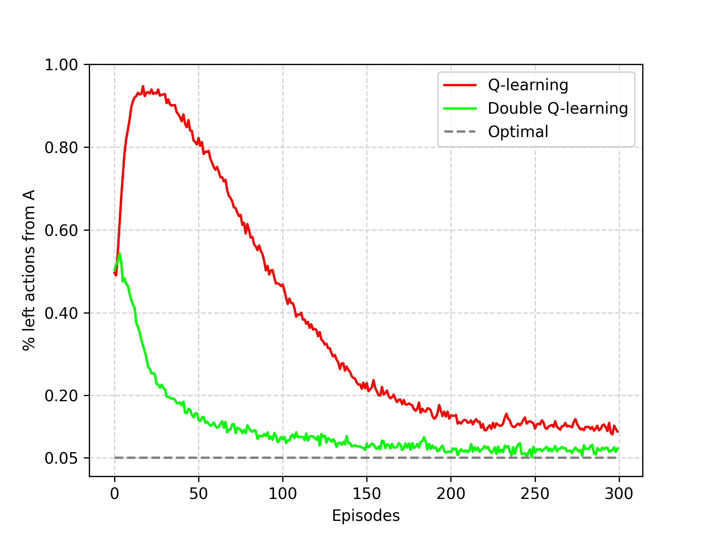

# Maximization Bias — Q-learning vs Double Q-learning

A small project implementing the maximization bias example from Sutton & Barto and reproducing Figure 6.5 comparing Q-learning and Double Q-learning performance.
The notebook reads reference images from `book_images/` and saves generated plots to `generated_images/`.

---

## Project structure

```
maximization_bias/
├─ book_images/            # reference images used in notebook (committed)
│  ├─ Figure_6_5_mdp.PNG
│  └─ Figure_6_5_graph.PNG
├─ generated_images/       # notebook will write generated PNGs here
│  └─ figure_6_5.png
├─ notebooks/              # Jupyter notebook (run this to reproduce figure)
│  └─ maximization_bias.ipynb
└─ src/                    # source package
   ├─ __init__.py
   └─ maximization_bias.py
```

---

## The MDP Problem

The experiment uses a simple 2-state MDP that demonstrates maximization bias:


  


- **State A**: Starting state with 2 actions (`left`, `right`)
  - `right`: Transitions to terminal state with reward = 0
  - `left`: Transitions to state B with reward = 0
- **State B**: Has 10 actions, all leading to terminal state
  - Rewards drawn from Normal(-0.1, 1.0) distribution
  - Expected return = -0.1, making `left` from A suboptimal

Despite `left` being suboptimal (expected return -0.1 vs 0), Q-learning suffers from maximization bias and learns to favor the `left` action more than optimal.

---

## How to run

Start Jupyter Lab / Notebook from the `maximization_bias/` folder so the notebook finds images with `../book_images` and writes output to `../generated_images`:

```bash
jupyter lab
# or
jupyter notebook
```

Open `notebooks/maximization_bias.ipynb` and run all cells. The notebook uses `matplotlib.use('Agg')` and saves figures to `../generated_images/figure_6_5.png`.

## Expected outputs & visualizations

The notebook generates one main figure:

* `generated_images/figure_6_5.png` — Maximization bias comparison (from `notebooks/maximization_bias.ipynb`).


  


  This plot shows **percentage of "left" actions taken from state A** (y-axis) vs **episode number** (x-axis) for two algorithms:
  - **Q-learning**: Shows maximization bias, converging to ~25% left actions
  - **Double Q-learning**: Corrects for bias, converging closer to optimal ~5% left actions
  - **Optimal**: Dashed line at 5% (with ε=0.1, optimal policy takes left action only during exploration)
  
  Key parameters:
  - `runs = 1000` independent runs for statistical reliability
  - `episodes = 300` per run
  - `exploration_probability = 0.1` (ε-greedy)
  - `step_size = 0.1` (α learning rate)
  - `discount = 1.0` (γ discount factor)
  - State B has 10 actions with Normal(-0.1, 1.0) reward distribution
  
  The figure demonstrates how Q-learning's single value function leads to overestimation bias, while Double Q-learning's dual value functions provide more accurate estimates and better performance.

## Algorithm Details

- **Q-learning**: Uses single action-value function Q(s,a) with max operator creating positive bias
- **Double Q-learning**: Maintains two action-value functions (Q₁, Q₂), alternately updated using the other for target calculation, reducing overestimation bias
- **Action Selection**: ε-greedy policy based on sum of estimates for Double Q-learning
- **MDP Environment**: Simple 2-state chain with stochastic rewards in state B