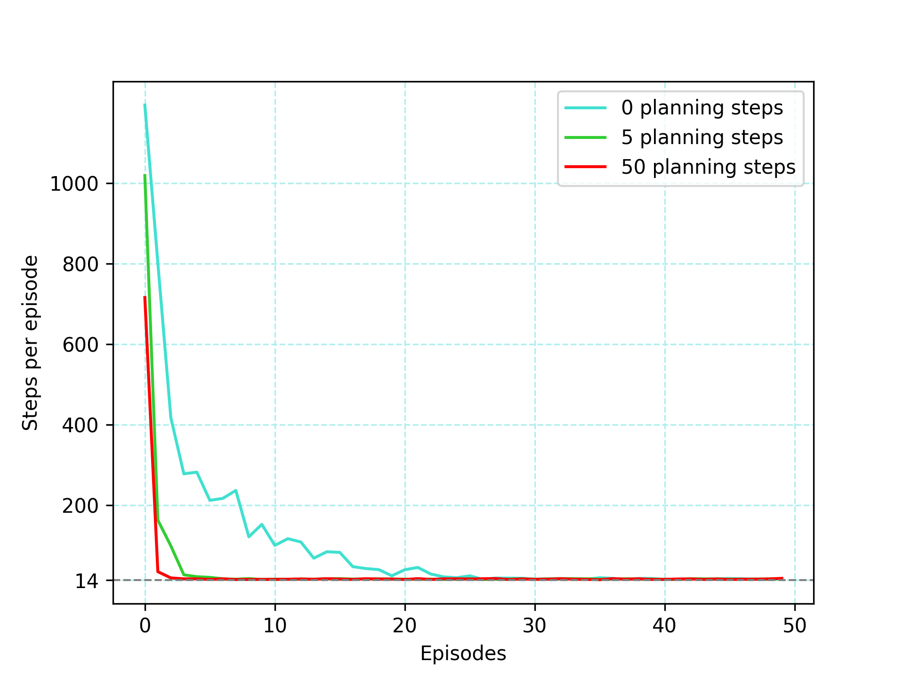
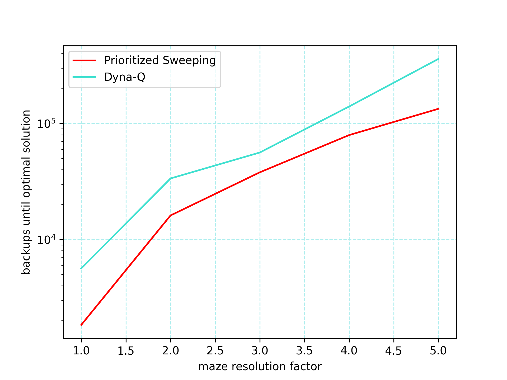
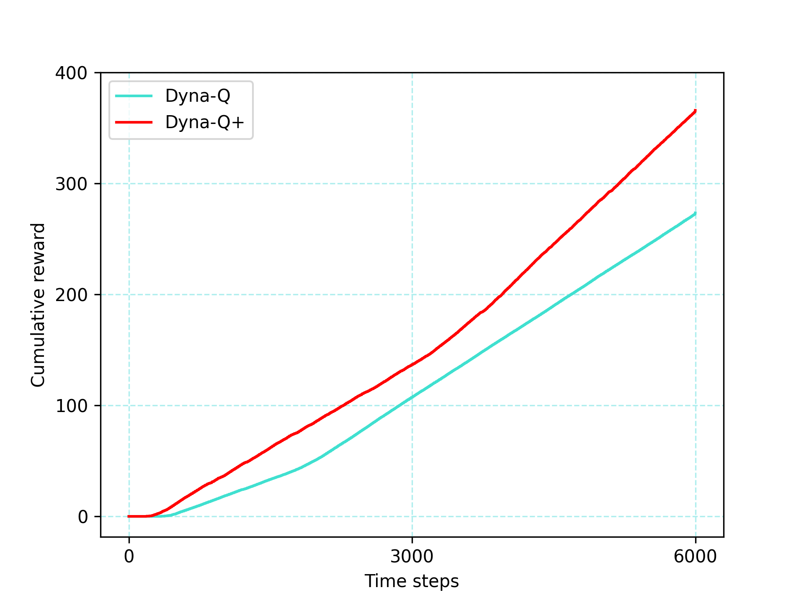

# Mazes — Dyna & Prioritized Sweeping experiments

A small project implementing maze environments and planning algorithms (Dyna-Q, Dyna-Q+, and Prioritized Sweeping) and notebooks that reproduce the figures from the experiments.
Notebooks read reference images from `book_images/` and save generated plots to `generated_images/`.

---

## Project structure

```
mazes/
├─ book_images/            # reference images used in notebooks (committed)
│  ├─ Example_8_4.PNG
│  ├─ Figure_8_2_graph.PNG
│  └─ ...
├─ generated_images/       # notebooks will write generated PNGs here
│  ├─ example_8_4.png
│  └─ ...
├─ notebooks/              # Jupyter notebooks (run these to reproduce figures)
│  ├─ changing_maze.ipynb
│  ├─ dyna_maze.ipynb
│  └─ prioritized_sweeping.ipynb
└─ src/                    # source package
   ├─ __init__.py
   ├─ dyna.py
   ├─ functions.py
   ├─ maze.py
   └─ models.py
```

---

## How to run

Start Jupyter Lab / Notebook from the `mazes/` folder so the notebooks find images with `../book_images` and write output to `../generated_images`:

```bash
jupyter lab
# or
jupyter notebook
```

Open any of:

* `notebooks/prioritized_sweeping.ipynb`
* `notebooks/dyna_maze.ipynb`
* `notebooks/changing_maze.ipynb`

Run cells. The notebooks use `matplotlib.use('Agg')` and save figures to `../generated_images/*.png` (they will be created automatically).

## Expected outputs & visualizations

Each notebook saves its figures into `generated_images/`. Descriptions below explain exactly what each plot shows and which notebook / parameters produce it.

* `generated_images/figure_8_2.png` — Learning curves (from `notebooks/dyna_maze.ipynb`).
  
  This plot shows **steps per episode** (y-axis) vs **episode number** (x-axis) for three Dyna agents that differ in number of planning steps `n = {0, 5, 50}`.  
  - Data are averaged over `runs = 10`.  
  - Each curve shows how quickly the agent learns: fewer steps means faster learning.  
  - A dashed horizontal line at `y = 14` marks the (relaxed) optimal path length.  
  - Key parameters: `planning_steps` (0,5,50), `episodes = 50`, `alpha` (step size) and `gamma` (discount) set in the notebook.  
  Use this figure to compare how increased planning (larger `n`) speeds up learning.


  


* `generated_images/example_8_4.png` — Backups until optimal (from `notebooks/prioritized_sweeping.ipynb`).

  This plot shows **total number of backups (planning updates)** required to reach the (relaxed) optimal solution as a function of **maze resolution factor** (x-axis: factor 1..K).  
  - Two methods are compared: **Prioritized Sweeping** and **Dyna-Q**.  
  - Experiments build mazes of increasing resolution (`extend_maze(factor)`), run `runs = 5`, and record backups per maze.  
  - For Dyna-Q the plotted value is adjusted to count all planning backups (`backups[1,:] *= params_dyna.planning_steps + 1`).  
  - The y-axis is shown on a log scale to highlight large differences.  
  Use this figure to compare planning efficiency (backups) as maze size grows — prioritized sweeping typically needs far fewer backups.


  


* `generated_images/figure_8_4.png` — Blocking-maze cumulative reward (from `notebooks/changing_maze.ipynb`).

  This plot shows **average cumulative reward over time** for two algorithms (Dyna-Q and Dyna-Q+) on a maze where a short route is **blocked** at `obstacle_switch_time` (1000 timesteps).  
  - The plot is produced by `changing_maze(...)`, which runs multiple independent runs and averages cumulative reward.  
  - Key settings in the notebook: `max_steps = 3000`, `obstacle_switch_time = 1000`, `runs = 20`, `planning_steps = 10`, and a small `time_weight` for Dyna-Q+.  
  - The curve illustrates: initial learning of the short path, a flat period immediately after the blocking (no reward while agents re-explore), and eventual recovery as agents learn the new long path.  
  - Dyna-Q+ (time-augmented model) usually recovers faster because its model encourages exploration of previously unvisited actions.


  


* `generated_images/figure_8_5.png` — Shortcut-maze cumulative reward (from `notebooks/changing_maze.ipynb`).

  This plot shows **average cumulative reward over time** for Dyna-Q and Dyna-Q+ in a maze where a **shortcut opens** at `obstacle_switch_time` (3000 timesteps).  
  - Notebook settings: `max_steps = 6000`, `obstacle_switch_time = 3000`, `runs = 5`, `planning_steps = 50`, `time_weight` tuned higher for this experiment.  
  - The x-axis ticks are `[0, 3000, 6000]` to emphasize pre-change and post-change behavior.  
  - The plot demonstrates a failure mode for plain Dyna-Q: once its model believes there is no shortcut, heavy planning can *prevent* it from discovering the new shortcut; Dyna-Q+ tends to detect the change and exploit the shortcut sooner, yielding higher cumulative reward after the change.


  
