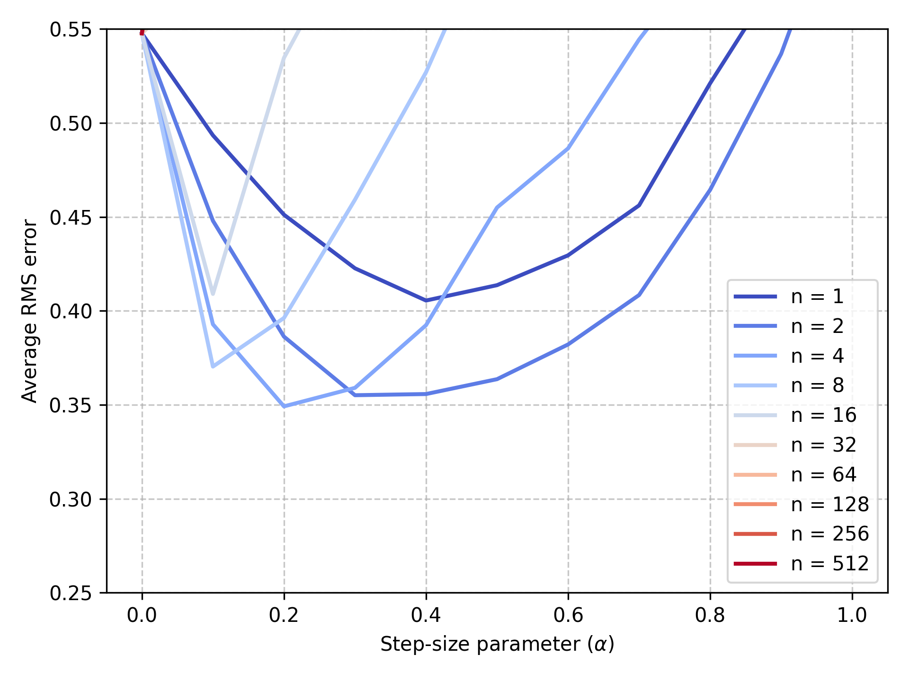
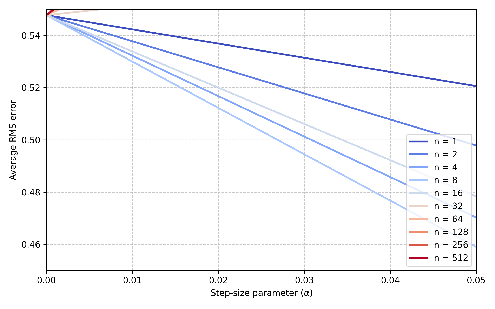

# Random Walk: n-step TD Methods

## Overview

This repository reproduces the empirical experiment from Chapter 7 (n-step methods) of Sutton & Barto’s *Reinforcement Learning* using a larger random-walk MRP (19 non-terminal states). The code implements the n-step Temporal-Difference (TD) update, runs repeated experiments over different `n` and `α` values, and generates the RMS-error plots (Figure 7.2 and a zoomed-in version) that illustrate how intermediate `n` often performs best.

Key points:

* Chain of 21 states total: `0` and `num_states + 1` are terminal (left terminal gives reward −1, right terminal gives reward +1). Non-terminal states are `1..num_states` (here `num_states = 19`).
* Episodes start in the middle state (`start_state = 10`) and proceed left/right uniformly at random until a terminal state is reached.
* The core algorithm is an in-place `n`-step TD update implemented in `src/random_walk.py::temporal_difference`.
* Experiments are set up in `notebooks/random_walk.ipynb`; this notebook reproduces the figure by running `runs=100` and `episodes=10` (as in the notebook).

---

## Project structure

```
random-walk/
├── src/
│   └── random_walk.py           # n-step TD implementation and hyper-parameters
├── notebooks/
│   └── random_walk.ipynb        # Notebook that runs experiments and produces figures
├── book_images/
│   └── Example_6_2_top.PNG      # Diagram used in the notebook (local copy)
├── generated_images/
│   ├── figure_7_2.png           # Saved main plot (produced by the notebook)
│   └── figure_7_2_zoomed.png    # Saved zoomed-in plot (top-left region)
└── README.md                    # This file
```

---


## How to run

1. From repository root, start Jupyter:

```bash
jupyter notebook notebooks/random_walk.ipynb
# or
jupyter lab notebooks/random_walk.ipynb
```

2. Open `random_walk.ipynb` and run cells top-to-bottom. The notebook:

* loads `temporal_difference` and constants from `src/random_walk.py`,
* runs the experiment loop over `steps`= $2^0$, $2^1$, ..., $2^9$ and `step_sizes = np.arange(0, 1.1, 0.1)`,
* computes averaged RMS errors across `runs` and `episodes`,
* saves figures to `generated_images/`.

Notes:

* The default notebook configuration in this repo sets `runs = 100` and `episodes = 10`. Running that full experiment can take several minutes (depends on machine).
* To shorten runtime for quick checks, reduce `runs` and/or `episodes` in the notebook.


## Expected outputs & visualizations

* `generated_images/figure_7_2.png` — main RMS error vs α plot for a range of `n` values.

  


* `generated_images/figure_7_2_zoomed.png` — zoomed-in version focused on the top-left region of the plot (small α).

  


The notebook includes the original book images under `book_images/` for reference. Figures are saved at `../generated_images/` relative to the notebook path; if you run the script runner from repo root, update paths accordingly.

---

## Implementation details & notes

* **Algorithm**: implements the n-step TD update as standard in RL literature:

  $$
  G_{t:t+n} = R_{t+1} + \gamma R_{t+2} + \dots + \gamma^{n-1} R_{t+n} + \gamma^n V(S_{t+n}),
  $$

  then updates

  $$
  V(S_t) \leftarrow V(S_t) + \alpha (G_{t:t+n} - V(S_t))
  $$

  for non-terminal $S_t$.
* **Termination handling**:

  * `termination_time` is initialized to `float('inf')` and set to the time index when a terminal state is experienced. This avoids referencing `next_state` before it is assigned and allows the algorithm to generate the episode until a terminal state is reached.
* **Bootstrapping**: the implementation **adds** the bootstrapped value to the discounted rewards (`estimated_return += γ^n V(S_{t+n})`) — do **not** overwrite the reward-sum with the bootstrap term (that would be incorrect).
* **Indexing**:

  * `num_states` is the number of non-terminal states (19).
  * Terminal states are `[0, num_states + 1]` (i.e., 0 and 20 for `num_states = 19`).
  * `value_estimates` arrays use padding so indices correspond to state ids directly (array length is `num_states + 2`).
* **Reproducibility**: set `np.random.seed(some_integer)` before running experiments when you want deterministic traces for debugging.