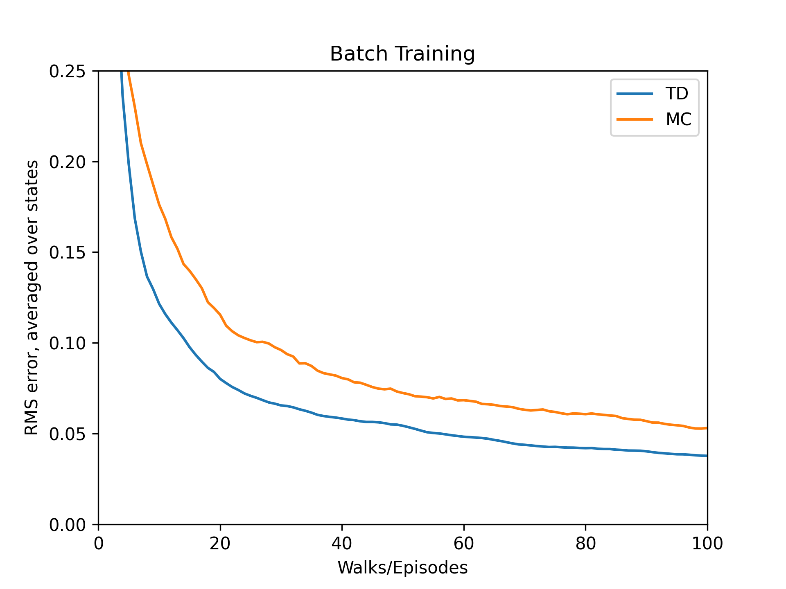

# Random Walk Prediction: Monte Carlo vs Temporal-Difference

## Overview

This project empirically compares the prediction performance of Monte Carlo (MC) and Temporal-Difference (TD(0)) methods on the classic Random Walk problem (Example 6.2 in Sutton & Barto’s *Reinforcement Learning*). In this Markov Reward Process (MRP):

- There are seven states labeled 0 to 6.
  - States 0 and 6 are terminal.
  - States 1–5 correspond to non-terminal states A–E.
- An episode starts in the center state (state 3, “C”).
- At each step, the agent moves left or right with equal probability.
- If the agent reaches the right terminal (state 6), it receives reward +1 and the episode ends; otherwise reward is 0. Hitting the left terminal yields reward 0.
- True state-values (undiscounted) for non-terminal states equal the probability of eventually terminating at the right terminal when starting from that state: for states 1–5: 1/6, 2/6, 3/6, 4/6, 5/6, respectively.

## Project Structure

```

random-walk/
├── src/
│   └── random_walk.py         # Implementation of environment, agent, value function, experiments
├── notebooks/
│   └── random_walk.ipynb      # Jupyter Notebook with explanations, plots, and reproductions of figures
├── book_images/
│   ├── Example_6_2_top.PNG    # Diagram of the Random Walk MRP
│   └── Example_6_2_bottom.PNG # True value plots from the book
├── generated_images/
│   ├── example_6_2.png        # Re-generated learning curves for online comparison
│   └── figure_6_2.png         # Re-generated batch learning curves
└── README.md                  # Documentation (this file)
```

## How to Run

### 1. Via Python script

From repository root, assuming current working directory is at `Reinforcement-Learning/random-walk`:

```bash
# Navigate to the subproject folder
cd Reinforcement-Learning/random-walk

# Run experiments with default settings
python -u src/random_walk.py
```

This will:

* Execute `run_experiment()` in the `if __name__ == "__main__":` block:

  * Run batch experiments for MC and TD with default parameters (e.g., episodes=100, runs=100).
  * Print final RMS errors for Monte Carlo and TD:

    ```
    Monte Carlo final error: <value>
    Temporal Difference final error: <value>
    ```
  * Attempt to plot learning curves:

    * Save plot to `random_walk_comparison.png` under current working directory.
    * Display the plot if possible.
* You may modify parameters by editing or extending `run_experiment(episodes=..., runs=...)` or adding command-line argument parsing as needed.

### 2. Via Jupyter Notebook

1. Launch Jupyter from repository root:

   ```bash
   jupyter notebook notebooks/random_walk.ipynb
   ```
2. In the notebook:

   * Review the Markdown cells explaining the MRP and algorithms.
   * Execute code cells sequentially:

     * Plot estimated values after specific episodes.
     * Run online experiments: multiple runs to produce RMS error vs episodes for different step-size parameters.
     * Run batch-learning experiments: gather and plot RMS error curves under batch updates.
   * Generated figures will be saved under `generated_images/` (ensure the folder exists or modify paths accordingly).

## Visualizations

* **Example 6.2 (Online Learning Curves)**

  * After certain episodes (e.g., 0, 1, 10, 100), plot estimated state-values vs true values for non-terminals A–E.
  * Plot RMS error vs episodes for different step-size (α) values, comparing MC and TD under online updates.

* **Batch Learning Curves**

  * After each episode, perform repeated updates over all observed episodes until convergence (threshold-based).
  * Plot RMS error vs episodes for batch-MC vs batch-TD, demonstrating batch-TD often outperforms batch-MC.

* Saved plots:

  * `generated_images/example_6_2.png`
  
  * `generated_images/figure_6_2.png`
  
