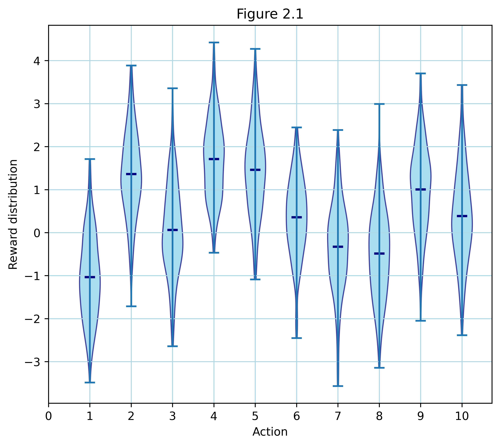
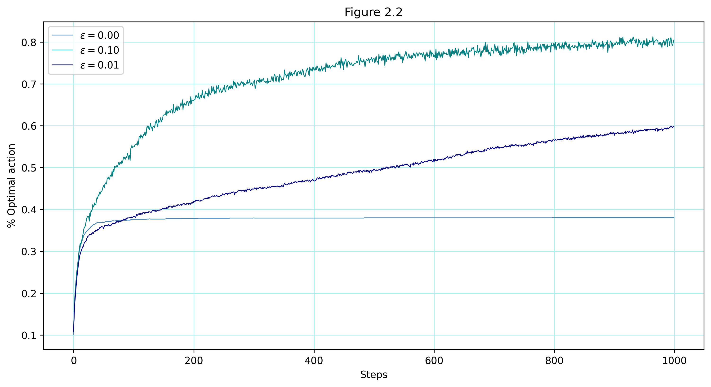
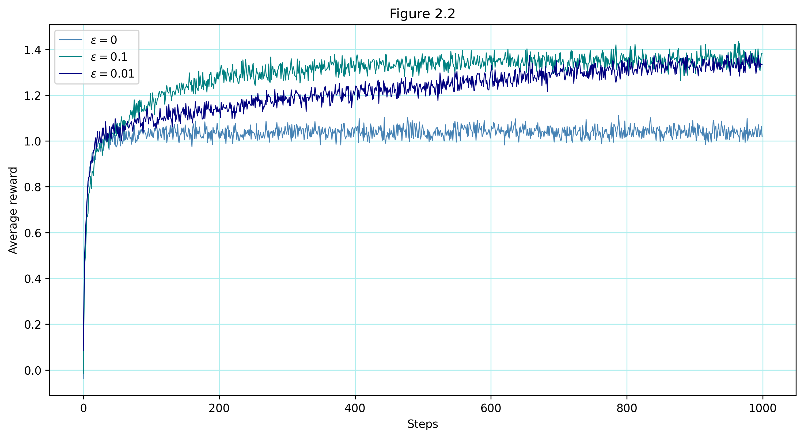
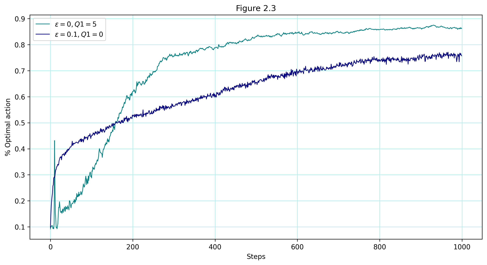
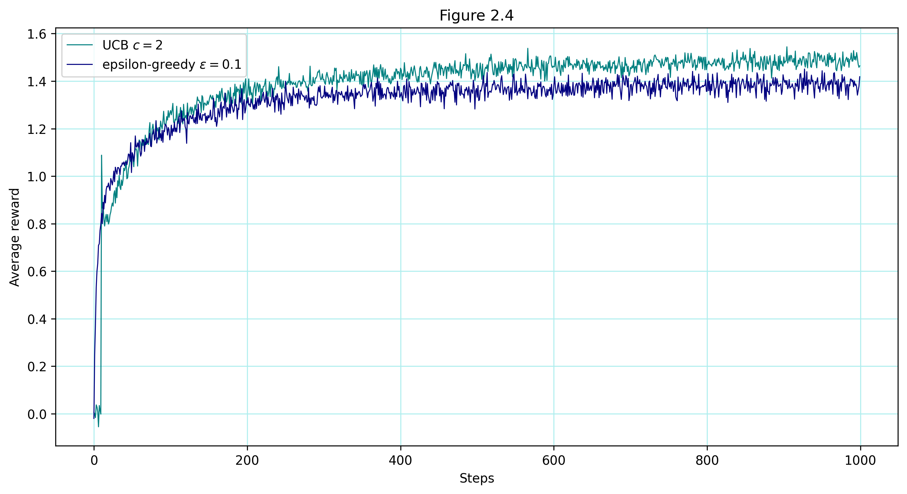
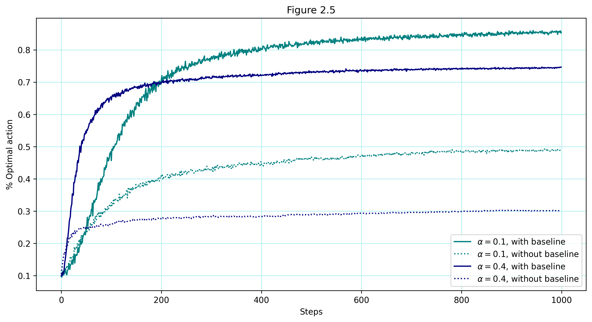
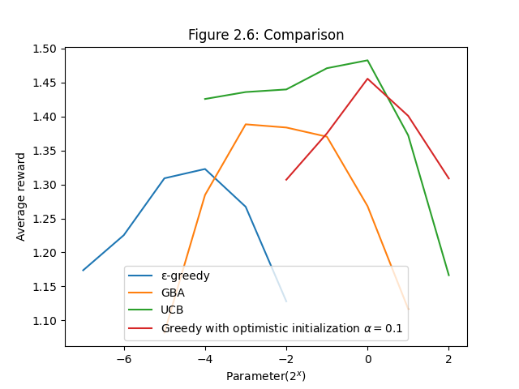

# 10‑Armed Testbed

## Overview

This project provides an experimental implementation of the k‑armed bandit problem using different action selection strategies (ε‑greedy, optimistic initial values, UCB, and gradient bandit methods). It is inspired by the multi‑armed bandit discussions in Chapter 2 (Multi‑armed Bandits) of Sutton & Barto’s *Reinforcement Learning*.

## Project Structure

```
ten-armed-testbed/
├── src/
│   └── bandit.py                # Implements the Bandit class and action selection strategies.
├── notebooks/
│   └── ten_armed_testbed.ipynb  # Jupyter Notebook with experiments and visualizations.
├── images/
│   ├── figure_2_1.png           # Reward distribution visualization.
│   ├── figure_2_2_reward.png    # Average reward comparison for ε‑greedy strategies.
│   ├── figure_2_2_action.png    # Comparison of optimal action percentages.
│   ├── figure_2_3.png           # Impact of optimistic initial values.
│   ├── figure_2_4.png           # UCB vs. ε‑greedy comparison.
│   ├── figure_2_5.png           # Gradient bandit performance.
│   └── figure_2_6.png           # Overall comparison of action selection methods.
└── README.md                    # This documentation file.
```

## How to Run

To launch experiments, use the following bash commands from the repository’s root:

```bash
# Run the notebook (if you prefer a graphical interface):
jupyter notebook notebooks/ten_armed_testbed.ipynb

# Alternatively, execute the main script (if available):
python src/bandit.py
```


## Visualizations  

The following figures are generated in `ten_armed_testbed.ipynb`:

- **Figure 2.1** – Reward distribution across 10 actions  
  

- **Figure 2.2—action** – Comparison of greedy vs. ε-greedy action selection strategies  
  

- **Figure 2.2 - reward** – Comparison of greedy vs. ε-greedy action selection strategies  
  

- **Figure 2.3** – Effect of optimistic initial values on action selection  
  

- **Figure 2.4** – Upper-Confidence-Bound (UCB) action selection  
  

- **Figure 2.5** – Performance of Gradient Bandit Algorithm (GBA)  
  

- **Figure 2.6** – Overall comparison of action selection methods  
  


Each figure is saved in the `images/` directory.