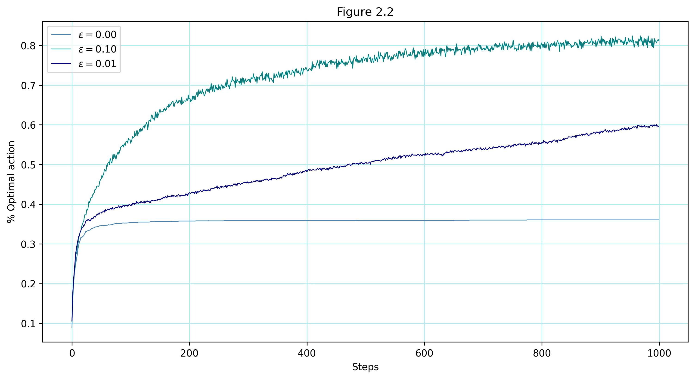
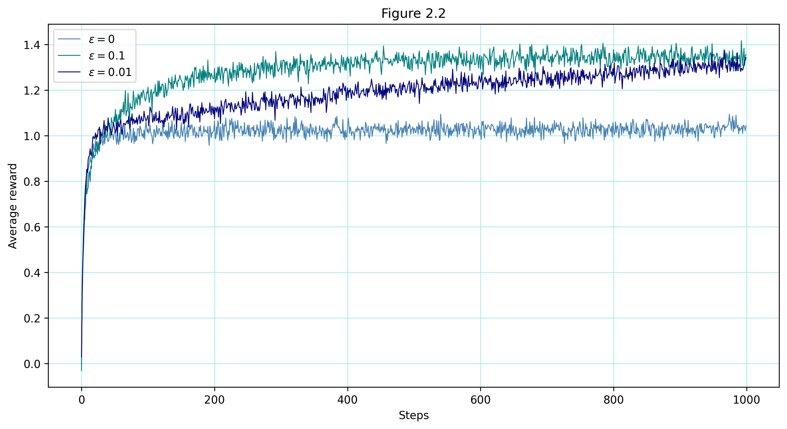
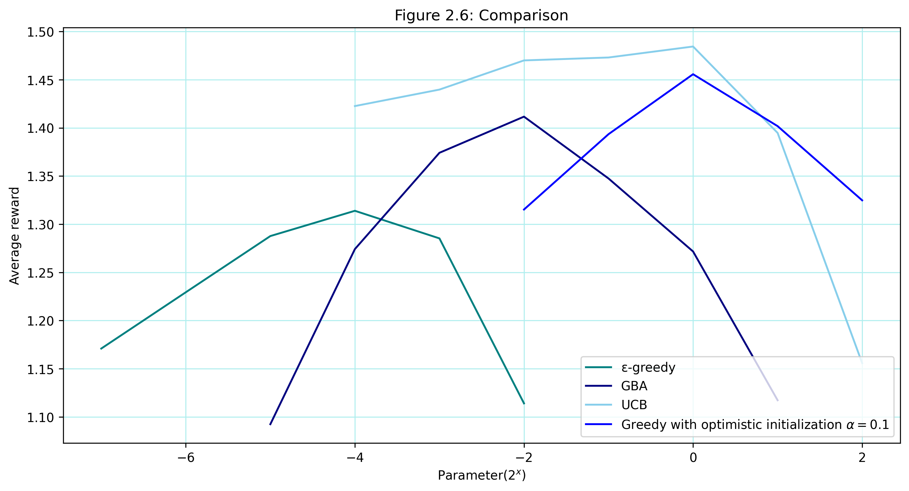

# 10-Armed Testbed

This subrepository contains an implementation of the **k-armed bandit problem** using various action selection strategies, including **ε-greedy**, **optimistic initial values**, **UCB**, and **Gradient Bandit Algorithm (GBA)**. The project provides visualizations to analyze the performance of these methods over multiple simulations.

---

## File Structure  

```
ten-armed-testbed/
│── src/
│   ├── bandit.py                # Implementation of the Bandit class
│── notebooks/
│   ├── ten_armed_testbed.ipynb  # Jupyter Notebook with experiments and visualizations
│── images/
│   ├── figure_2_1.png           # Reward distribution visualization
│   ├── figure_2_2_reward.png    # Comparison of ε-greedy strategies (average reward)
│   ├── figure_2_2_action.png    # Comparison of ε-greedy strategies (% optimal action)
│   ├── figure_2_3.png           # Optimistic vs. realistic initial values
│   ├── figure_2_4.png           # UCB vs. ε-greedy
│   ├── figure_2_5.png           # Gradient Bandit Algorithm
│   ├── figure_2_6.png           # Overall comparison
│── requirements.txt             # List of dependencies
│── README.md                    # This file
```

---

## Goal  

The goal of this project is to simulate **reinforcement learning** methods for solving the **k-armed bandit problem** and evaluate their performance using **reward distributions** and **optimal action percentages**.

---

## Visualizations  

The following figures are generated in `ten_armed_testbed.ipynb`:

- **Figure 2.1** – Reward distribution across 10 actions  

- **Figure 2.2—action** – Comparison of greedy vs. ε-greedy action selection strategies  

- **Figure 2.2 - reward** – Comparison of greedy vs. ε-greedy action selection strategies  

- **Figure 2.3** – Effect of optimistic initial values on action selection  

- **Figure 2.4** – Upper-Confidence-Bound (UCB) action selection  

- **Figure 2.5** – Performance of Gradient Bandit Algorithm (GBA)  

- **Figure 2.6** – Overall comparison of action selection methods  


Each figure is saved in the `images/` directory.

---

## Installation  

Ensure you have Python installed, then install the required dependencies:

```bash
pip install -r requirements.txt
```
