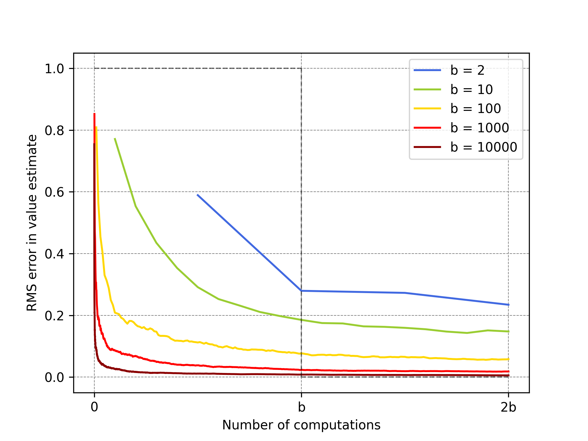

# Expected vs. Sample Updates: Computational Trade-offs

## Overview

This repository reproduces the computational analysis from Chapter 8 of Sutton & Barto's *Reinforcement Learning* that compares expected updates versus sample updates. The code implements both update types, runs experiments over different branching factors, and generates the RMS-error plot (Figure 8.7) that illustrates when sample updates are computationally preferable to expected updates.

Key points:

* **Computational trade-off**: Expected updates require `b` times more computation than sample updates (where `b` is the branching factor).
* **Error analysis**: Expected updates eliminate sampling error completely, while sample updates follow error decay of √((b-1)/(bt)).
* **Practical insight**: For large branching factors, many sample updates can achieve near-optimal performance while updating many more state-action pairs.
* **Implementation**: Core algorithm in `src/expectation_vs_sample.py::calculate_errors` simulates the estimation process.
* **Experiments**: Set up in `notebooks/expectation_vs_sample.ipynb`; reproduces Figure 8.7 with `runs=100` across `branching_factors=[2, 10, 100, 1000]`.

---

## Project structure

```
expectation-vs-sample/
├── src/
│   └── expectation_vs_sample.py    # Error calculation implementation
├── notebooks/
│   └── expectation_vs_sample.ipynb # Notebook that runs experiments and produces figures
├── book_images/
│   └── Figure_8_7.PNG              # Reference image from the book
├── generated_images/
│   └── figure_8_7.png              # Saved plot (produced by the notebook)
└── README.md                       # This file
```

---

## How to run

1. From repository root, start Jupyter:

```bash
jupyter notebook notebooks/expectation_vs_sample.ipynb
# or
jupyter lab notebooks/expectation_vs_sample.ipynb
```

2. Open `expectation_vs_sample.ipynb` and run cells top-to-bottom. The notebook:

* loads `calculate_errors` from `src/expectation_vs_sample.py`,
* runs the experiment loop over `branching_factors = [2, 10, 100, 1000, 10000]`,
* computes averaged RMS errors across `runs = 100`,
* saves figure to `generated_images/`.

Notes:

* The default configuration runs 100 independent trials for each branching factor. This typically completes in under a minute.
* To speed up for quick checks, reduce `runs` in the notebook.

## Expected outputs & visualizations

* `generated_images/figure_8_7.png` — RMS error vs computational cost for different branching factors.


  


* `book_images/Figure_8_7.png` 


  


The plot shows estimation error (y-axis) versus number of computations normalized by branching factor (x-axis). Key observations:

* **X-axis scale**: 0 to 2b where b=1 represents the cost of one expected update
* **Multiple curves**: Each represents a different branching factor (b = 2, 10, 100, 1000, 10000)
* **Error decay**: Sample updates show rapid initial improvement, then diminishing returns
* **Critical insight**: For large b, sample updates achieve most benefits with a small fraction of expected update cost

---

## Implementation details & notes

* **Problem setup**: 
  - Single state-action pair with branching factor `b`
  - Initial estimation error = 1
  - Next state values assumed correct (true value = mean of distribution)
  - Sample updates use running average (α = 1/t)

* **Error calculation**:
  - True value computed as `np.mean(distribution)` where distribution represents next state values
  - Each sample update draws one value from the distribution: `np.random.choice(distribution)`
  - Running estimate maintained as sample average over all draws so far
  - Error recorded as absolute difference: `|sample_mean - true_value|`

* **Computational model**:
  - Expected update: Requires `b` computations, reduces error to 0
  - Sample update: Requires 1 computation, error follows √((b-1)/(bt)) formula
  - Experiment runs `2 * b` sample updates to show behavior beyond single expected update cost

* **Branching factor effects**:
  - Small `b` (2): Expected updates competitive
  - Large `b` (1000): Sample updates dramatically more efficient
  - Crossover depends on specific problem characteristics and computational constraints

* **Reproducibility**: The implementation uses `np.random.randn(branching_factor)` to generate value distributions and `np.random.choice()` for sampling. Set `np.random.seed()` before experiments for deterministic results.