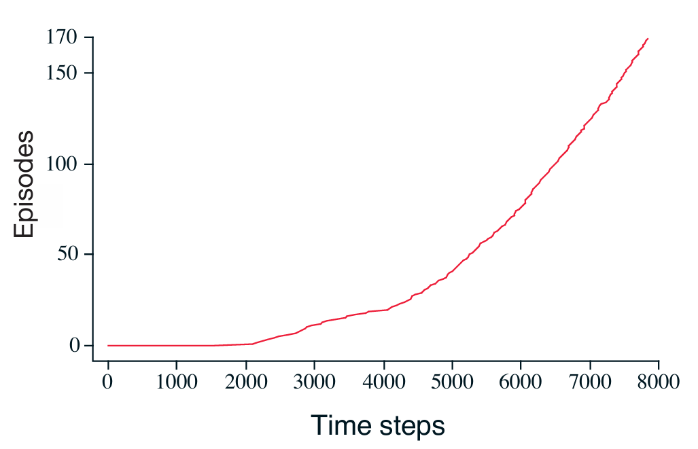
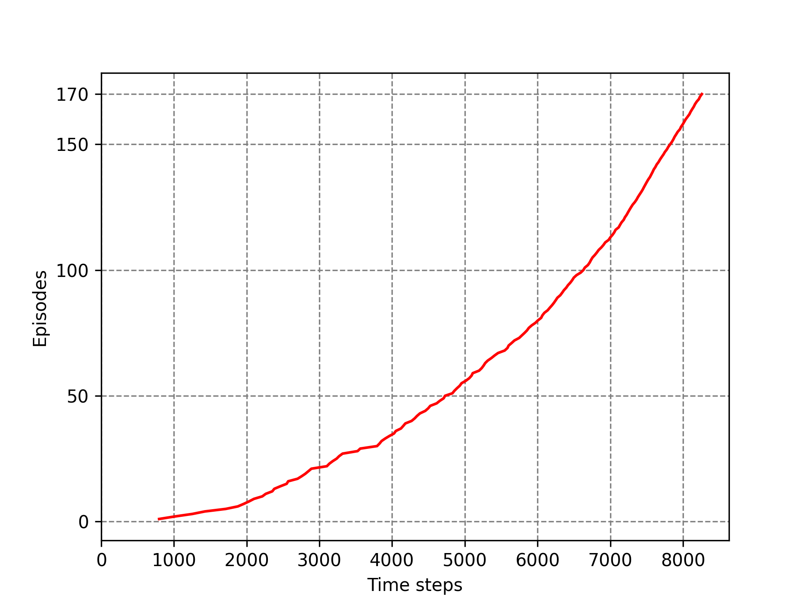

# Windy Gridworld

## Overview

This repository contains an implementation of the “Windy Gridworld” task as described in Example 6.5 (Windy Gridworld) of Sutton & Barto’s *Reinforcement Learning*. In this episodic task, an agent navigates a 7×10 grid from a start state to a goal state, while a column‐wise “wind” pushes the agent upward. We use ε‐greedy SARSA (on‐policy TD control) to learn the action‐value function  Q(s,a)  and improve the agent’s policy over episodes.


Key characteristics:
- **State space**: All cells in a 7 (height) × 10 (width) grid.  
- **Action space**: Four deterministic moves (↑, ↓, ←, →), with wind perturbation.  
- **Wind**: Column‐specific upward shifts (0–2 cells per column).  
- **Episode reward**: −1 per time step until the goal is reached.  
- **Discount factor** γ = 1 (undiscounted).  
- **Learning**: SARSA with step‐size α = 0.5 and exploration probability ε = 0.1.  

## Project Structure

```

windy-gridworld/
├── book_images/
│   ├── Example_6_5_inset.PNG      # Diagram of the grid, start/goal, and wind strengths
│   └── Example_6_5_graph.PNG      # Learning curve from the textbook example
├── generated_images/
│   └── example_6_5.png            # Learning curve produced by our implementation
├── notebooks/
│   └── windy_grid_world.ipynb     # Jupyter Notebook: walkthrough, code cells, and plots
├── src/
│   ├── __init__.py                # Package initializer
│   └── windy_grid_world.py        # Core implementation: hyper‐parameters, step(), choose\_action(), play()
└── README.md                      # This documentation file

````

### Directory Details

- **book_images/**: Static reference figures from Sutton & Barto’s book.  
- **generated_images/**: Figures produced by running the notebook or scripts in this repo.  
- **notebooks/**: Interactive Jupyter Notebook showing:
  - Grid schematic (inset)  
  - Code to run SARSA on Windy Gridworld  
  - Plot of cumulative time‐steps vs. episodes  
  - Printed representation of the learned optimal policy  
- **src/**: Python module implementing the SARSA algorithm for this environment.  
- **README.md**: Project overview, structure, and usage instructions.  

## How to Run

### Via Jupyter Notebook

Launch the notebook for an interactive walkthrough, visualization, and policy display.

```bash
jupyter notebook notebooks/windy_grid_world.ipynb
```

Within the notebook you will see:

* **Inset diagram** of the windy grid (from `book_images/Example_6_5_inset.PNG`).
* **Code cells** that instantiate the environment, run ε‐greedy SARSA, accumulate time steps, and plot results.
* **Generated plot** saved to `generated_images/example_6_5.png` and displayed inline.
* **Computed optimal policy** printed as a grid of arrows and `G` at the goal state.


This will reproduce the learning curve and save it under `generated_images/`.

## Visualizations

* **Textbook Graph** – Reference learning curve from Sutton & Barto 


* **Generated Learning Curve** – Output of our SARSA implementation 

